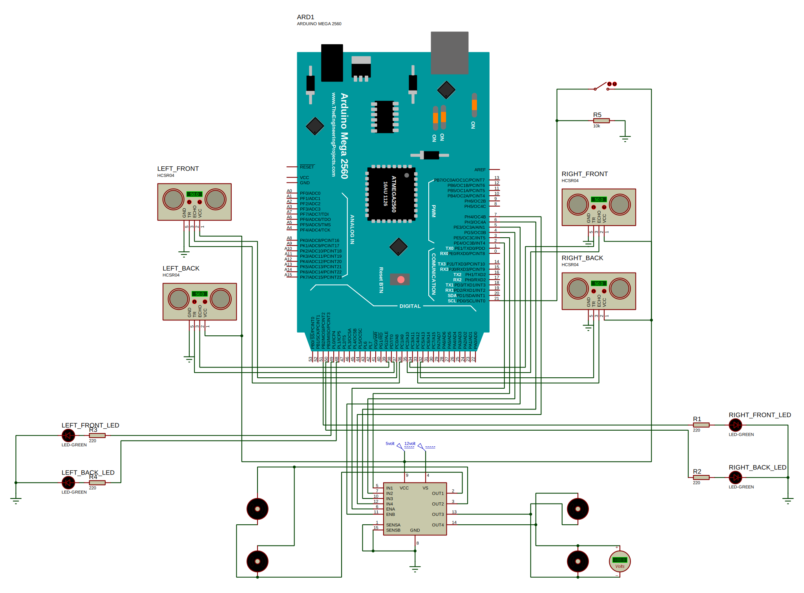

# Sensor-Based Wall-Following Algorithm for a Mobile Robot

## Abstract
This study investigates the performance of an Ultrasonic sensor in a wall-following algorithm for a 4-wheeled drive robot and explores the efficacy of a moving average filter in mitigating measurement errors. The Ultrasonic sensor exhibited a measurement error of $0.5438±0.1395 cm$. Applying a moving average filter resulted in a substantial reduction in the standard deviation of the measurement error with improvements ranging by $54.8%, 62.65%, 67.81%,$ and $72.54%$ for window sizes of $5, 7, 10,$ and $15$ respectively. Additionally, the study introduced a Proportional-Derivative (PD) controller to maintain the robot in parallel to the wall, achieving desired responses with reasonable rise time ($t_r$), settling time ($t_s$), zero percent overshoot ($M_p$), and zero steady-state error ($e_{ss}$). This research provides valuable insights for the design and optimization of wall-following algorithms in 4-wheeled drive robots, offering a practical framework for selecting filtering strategies and control mechanisms to enhance performance in diverse operational environments.

## Table of Contents
1. [Introduction](#introduction)
2. [Materials and Methods](#materials-and-methods)
    - 2.1 [Performance Tests](#performance-tests)
    - 2.2 [Robot Navigation](#robot-navigation)
    - 2.3 [Software Architecture](#software-architecture)
    - 2.4 [Hardware Architecture](#hardware-architecture)
3. [Discussion](#discussion)
   - 3.1 [Performance Tests of Ultrasonic Sensor](#performance-tests-of-ultrasonic-sensor)
   - 3.2 [Simulation of the Proposed Algorithm](#simulation-results)
5. [Results](#results)
6. [Conclusion](#conclusion)

## Introduction 
Research on path-following and wall-following of mobile robots is a critical area in the field of robotics with applications in autonomous navigation, industrial automation, and environmental monitoring. Path-following involves guiding a robot along a predefined or dynamically generated path, while wall-following requires the robot to navigate alongside a wall or obstacle. These capabilities are essential for tasks such as exploration, surveillance, and automated material handling. Various algorithms and methods have been developed to enable mobile robots to effectively track and navigate along walls or obstacles, using ultrasonic sensors, advanced control algorithms, and machine learning techniques such as random forest and genetic algorithms. The integration of advanced algorithms, sensor technologies, and machine learning methods significantly improves the path-following and wall-following capabilities of mobile robots, enabling them to operate more autonomously and effectively in diverse real-world scenarios.

## Materials and Methods 

### Performance Tests 
In this study, we conducted performance testing for an ultrasonic sensor interfaced with an Arduino microcontroller. The primary objective was to collect precise measurements from the sensor and subsequently employ Fourier Transform analysis (FFT) to discern the underlying noise characteristics in the acquired data. The Discrete Fourier Transform (DFT) of a signal $x[n]$ is given by:
$$X[k] = \sum_{n=0}^{N-1} x[n] e^{-j2\pi nk/N} ...(1)$$
Where:
- $X[k]$ represents the k-th frequency component of the signal in the frequency domain.
- $x[n]$ denotes the discrete samples of the signal in the time domain.
- $N$ is the total number of samples.

To enhance the reliability of the obtained data, a Moving Average Filter was implemented as a pre-processing step. The Moving Average Filter is commonly used in signal processing to mitigate high-frequency noise and fluctuations, providing a smoother representation of the underlying signal:
$$y[n] = \frac{1}{N} \sum_{k=0}^{N-1} x[n-k] ...(2)$$
Where:
- $y[n]$ signifies the output of the filter at time index $n$.
- $x[n-k]$ denotes the input signal samples at different time instances within the filter span.
- $N$ represents the number of samples considered in the moving average computation.

### Robot Navigation 
Keeping the y-axis of the robot $d_y$ parallel to the exterior border straightness $d_{ex}$ helps the robot navigate safely without crashing into the wall. The angle $\theta$ between $d_y$ and $d_{ex}$ is calculated using:
$$\theta = \tan^{-1} \left(\frac{d_1 - d_2}{d}\right) ...(3)$$
Where:
- $d_2$ and $d_1$ represent the distances measured by the front and back-sided sensors respectively.
- $d$ is the sided sensors spacing (the distance between the two sided sensors).

The algorithm uses a PD controller to maintain a safe distance from the wall:
$$m(t) = {K_P} e(t) + K_D \frac{de(t)}{dt} ...(4)$$
Where:
- $K_P$ is the constant of proportionality of the error signal.
- $K_D$ is the constant of proportionality of the derivative of the error signal.
- $e(t)$ is the difference between the set point ($150mm$) and the current real distance $D$.

The real perpendicular distance $D$ between the border and the center of the robot's mass is calculated as follows:
$$D = \frac{d_1 + d_2}{2} \cos \theta...(5)$$
Where:
- $d_1$ and $d_2$ are the same as in the equation $(3)$.
- $\theta$ is the angle calculated according to the equation  $(3)$.

  

  <i>Figure 1: schema of the measurements required to calculate $\theta$ </i>

### Software Architecture 

- Arduino C Programming Language

- Proteus 8 Professional

### Hardware Architecture 

- ArduinoMega 2560
- Motor Driver (L298N)
- DC Motor
- Ultrasonic Sensor
- 3-Cell LiPo Battery

<i> Figure 2: Robot Circuit Proteus Design</i>

## Discussion 

### Performance Tests of Ultrasonic Sensor 
The ultrasonic sensor's accuracy in measuring distance was determined using $10$ performance tests by collecting $100$ measurements for each actual distance. The measurement error calculated in these tests was $0.5438±0.1395 cm$. Applying a moving average filter with window sizes of $5, 7, 10,$ and $15$ samples resulted in decreased standard deviation of the measurement error.

<i> Figure 3: Before Applying Moving Average Filter on Sensor Measurements</i>
 
| Window Size | $$5$$ | $$7$$ | $$10$$ | $$15$$ |
|-------------|---|---|----|----|
| Error Standard Deviation | $$0.0631$$ | $$0.0521$$ | $$0.0449$$ | $$0.0383$$ |
| Filtering Results| ")
<i> Figure 4: After Applying Moving Average Filter (Window Size = 5)</i>
 | ")
<i> Figure 5: After Applying Moving Average Filter (Window Size = 7)</i>
 | ")
<i> Figure 6: After Applying Moving Average Filter (Window Size = 10)</i>
 | ")
<i> Figure 7: After Applying Moving Average Filter (Window Size = 15)</i>

### Simulation of the Proposed Algorithm 
To follow the wall in parallel to its straightness, we adjusted the robot's motion using a PD controller. The P-Controller achieved the desired state where $\theta = 0$. The PD-Controller with appropriate gains ($k_P = 0.1$, $k_D = -0.05$) decreased the rise time $t_r$ and settling time $t_s$ without any overshoot. For $k_D = -0.005$, the system response was sluggish.

|")
<i> Figure 8: PID Controller Response ($K_p = 0.1, K_d = 0, K_i = 0$)</i>
|")
<i> Figure 9: PID Controller Response ($K_p = 0.1, K_d = -0.05, K_i = 0$)</i>
|")
<i> Figure 10: PID Controller Response ($K_p = 0.1, K_d = -0.06, K_i = 0$)</i>
|
|---|---|---|

## Results 
The key findings from this study include:
1. The ultrasonic sensor demonstrated a measurement error of $0.5438±0.1395 cm$.
2. Application of a moving average filter significantly reduced the standard deviation of the measurement error, enhancing the sensor's performance.
3. The PD controller successfully maintained the robot's orientation parallel to the wall, providing an effective wall-following mechanism.
4. As the sensor spacing $d$ increases, the accuracy of the error calculation is ehanced leading to better wall following.

## Conclusion 
This study provides a comprehensive analysis of a sensor-based wall-following algorithm for a mobile robot, highlighting the importance of filtering strategies and control mechanisms. The findings offer a practical framework for optimizing wall-following performance in various operational environments, contributing to advancements in autonomous navigation systems.

  

  <i>Figure 11: 4-Wheeled Drive Robot Final Setup</i>

